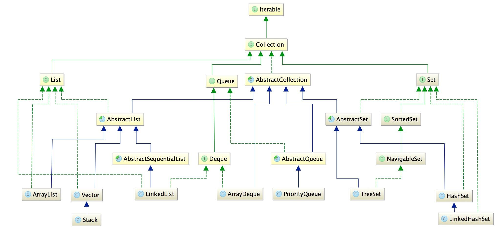

# java之collection总结

**Collection**

# List

名称   | 特点对比   
---   | ---  
ArrayList|特点对比
LinkedList| 特点对比
Vector| 特点对比
Stack| 特点对比

* `ArrayList`:**线程不同**
* `LinkedList`:**线程不同**
* `Vector`:**线程不同**
* `Stack`:**线程不同**
* `ArrayDeque`:**线程不同**
* `PriortyQueue`:**线程不同**
* `TreeSet`:**线程不同**
* `HashSet`:**线程不同**
* `LikedHashSet`:**线程不同**
